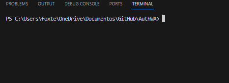
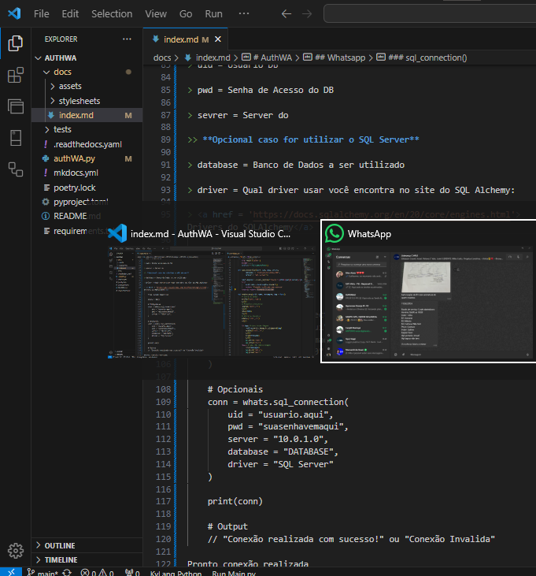
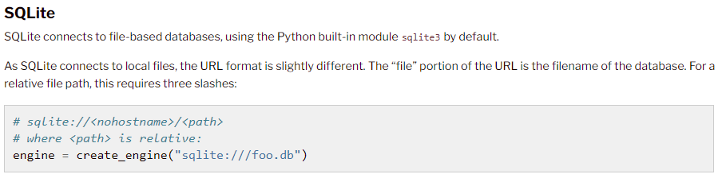
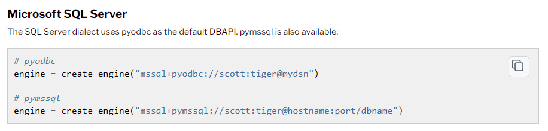
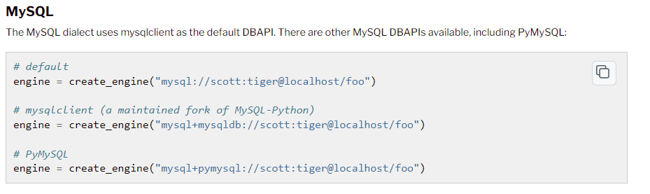
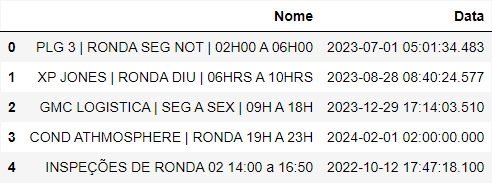
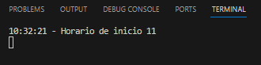

# AuthWA

## Banco de Dados Permitidos!

## Instalação

### Como instalar
Rode o comando abaixo em seu terminal ou CMD!

    pip install authwa

### Execução

Importe o modulo e adicione a uma variavel, chamando a classe desejada!

    import authWA

    whats = authWA.WA()

    whats.enviar_msg()

## Preparando o ambiente de envio

Após criar abra o terminal(PowerShell) ou CMD.

> No windows: 
>> apertando __WIN + R__ e digitando __CMD__ pressione *Enter*

> No Linux: 
>> apertando __CTRL + T__ ou __CTRL + ALT + T__ ou pressione __COMMAND ou WIN__ e digite *TERMINAL*

Terminal

Agora abra o WhatsApp faça o seguinte atalho *ALT + TAB*,
Para voltar ao terminal !

Para que seu codigo funcione é importante que deixe o whatsapp aberto, pois o codigo irá usar o atalho *Alt + Tab* para acessa-lo. 

É importante também que __não movimente ou clique com o mouse e nem pressione nenhuma tecla__ durante o processo, o indicado é ter uma maquina como servidor para que o codigo tenha mais eficiencia, mas não é obrigatório.

## Whatsapp
Envio de mensagens simples e com Imagens no o Whatsapp, para deixar sua imaginação fluir e construir suas automações!

>### Objetivo
> A Intenção deste modulo do AuthWA, é que você consiga usar a critividade para criar suas automações.

### **Envio simples de mensagem**

Para envio de mensagens simples, usando o modulo __WA__, é bem fácil, porém lembre-se bem deste módulo, pois ele será muito importante nos módulos a frente!

Importando o WA()

    from authWA import WA

    whats = WA()

A partir dai podemos utilizar seus modulos

> Dentro do WA() temos os seguintes modulos

> - enviar_msg( )
> - sql_connection( )
> - criar_imagem_SQL( )

### enviar_msg()
Está função faz um envio __simples ou com uma imagem__ embutida, para isto precisa ter preparado o ambiente.

> **Parametros**

> Nome = Nome do Contato a ser enviado a mensagem

> Mensagem = Mensagem a ser enviada ou a Legenda que vai na imagem

> Img = Aqui você devera colocar o caminho da Imagem a ser enviada

    from authWA import WA

    whats = WA()

    # Envio sem imagem
    whats.enviar_msg(
        nome = "Nome do contato",
        mensagem = "Isto foi enviado pelo AuthWA"
    )

    # Envio com imagem
    whats.enviar_msg(
        nome = "Nome do contato",
        mensagem = "Isto foi enviado pelo AuthWA"
        img = "imagens/image.png"
    )

### sql_connection()
Para realizar uma conexão com o banco de dados, precisamos de alguns parametros, lembre-se sempre que for realizar uma conexão com o banco de dados, faze-la no **incio** do projeto!
> **Parametros**
>> **Obrigatórios**

> uid = Usuário DB

> pwd = Senha de Acesso do DB

> server = Servidor do DB

>> **Opcional caso for utilizar o SQL Server**

> database = Banco de Dados a ser utilizado

> driver = Qual driver usar você encontra no site do SQL Alchemy:

> <a href = 'https://docs.sqlalchemy.org/en/20/core/engines.html'> Drivers do SQLAlchemy</a>

SQLite

SQL Server

MySQL

Exemplo de código

    from authWA import WA

    whats = WA()

    # Obrigatorio
    conn = whats.sql_connection(
        uid = "usuario.aqui",
        pwd = "suasenhavemaqui",
        server = "10.0.1.0",
    )

    # Opcionais
    conn = whats.sql_connection(
        uid = "usuario.aqui",
        pwd = "suasenhavemaqui",
        server = "10.0.1.0",
        database = "DATABASE",
        driver = "SQL Server"
    )   

    print(conn)

    # Saida do código
    // "Conexão realizada com sucesso!" 
    ou
    // "Conexão Invalida"

### criar_imagem_SQL()
Com a conexão realizada você pode agora fazer pesquisas e elas seram tranformadas em um arquivo PNG

> Parametros

> - consulta = Consulta SQL para gerar o Dataframe.

> - arquivo = Diretorio onde salvar o arquivo, este item é OPCIONAL, ja que o diretório padrão é __*dist/temp.png*__ e indicamos utilizar ele.

    from authWA import WA

    whats = WA()

    # Se conectando ao DB
    whats.sql_connection(
        uid = 'usuario.db',
        pwd = 'minhasenha',
        server = '10.10.0.10'
    )

    # Criando Imagem
    img = whats.criar_imagem_SQL(
        consulta = """
        SELECT Nome, TerminoReal as Data
        FROM Table
        """,
        arquivo = './img.png' # Lembrando que passar o arquivo é OPCIONAL
    )

    print(img)

Detalhe: A saida do print acima não será a imagem de fato e sim o caminho até ela, exemplo: __caminho/arquivo.png__

**Saida:** 

*./img.png*

**Imagem:**

## Parcial
### O que é Parcial ???
*Parcial é basicamente algo mais intenso do que uma simples mensagem !*

Sabe aquele acompanhamento que você quer fazer seja pra sua empresa ou pra uso pessoal? Aquele acompanhamento Hora a Hora, pois é com o Parcial você consegue facilmente.

Sabe Aquela mensagem te lembrando de fazer algo ou de uma agenda que você não pode esquecer e tem que receber essa mensagem numa hora especifica, com o Parcial é mais facil.

Aquela mensagem para seus clientes que lembrando das promoções, sempre em um horario especifico, com o Parcial, você consegue facilmente.

### Parcial - O começo

Bom, para criarmos o hora a hora, é bem simples, vamos usar alguns conceitos do WA() então é importante que tenha dominio com este modulo

    from authWA import Parcial

    # Para mensagens simples
    p = Parcial('','','')

    # Para mensagens com DB
    p = Parcial(
        'usuario.db',
        'minhasenha',
        '10.0.0.1' # Exemplo de Servidor
    )

    lista_de_contatos = []
Normalmente você quer usar o Parcial quando se trata de muitos contatos!
Pensando nisso, vamos utilizar um lista para os contatos 
Lembrano que ira enviar somente dias da Semana ou seja de Segunda a Sexta, para fim de semanas e horarios exatos, iremos falar depois!

**Lambda:**

Dentro desta lista, vamos passar funções, mas para que ela não seja chamada, iremos usar uma função do Python chamada **lambda:**

<a href = "https://www.hashtagtreinamentos.com/funcoes-lambda-python?gad_source=1&gclid=CjwKCAiA_aGuBhACEiwAly57MceSncFkfqjcgHiMp7jKizAKtmOr_FXWju7Ldqj7osean_5glMJXwhoCLoYQAvD_BwE"> Clique aqui para mais informações sobre o lambda </a>

    from authWA import Parcial

    p = Parcial('','','')

    lista_de_contatos = [
        # Agora iremos criar a lambda!
        lambda: function()
    ]

### Parcial - Dias de Semana

Para criarmos as parciais do dias da semana iremos usar uma *tuple*

    tuple = (
        lambda:function2()
        lambda:function()s, 
    )

No lugar desta **function()** iremos usar o nosso conhecimento do módulo WA(), iremos chamar a função de mensagem deste modulo dentro da *lambda*

Mas não precisamos importar o modulo WA() pois ele ja esta embutido no Parcial(), ele esta definido como *whats*, sendo assim podemos chama-lo usando a variavel onde colocamos o Parcial().

    from authWA import Parcial

    p = Parcial('','','')

    # Lista que criamos acima
    lista_de_contatos = []

    # Criando a tupla dos dias de semana
    dds = (
        lambda: p.whats.enviar_mensagem(
            nome = "Contato 1",
            mensagem = "Codando com AuthWA!"
        ),
        lambda: p.whats.enviar_mensagem(
            nome = "Contato 2",
            mensagem = "Codando com AuthWA!"
        ),
        lambda: p.whats.enviar_mensagem(
            nome = "Contato 3",
            mensagem = "Codando com AuthWA!"
        ),
    )

    # Usamos o APPEND para adicionarmos a tuple(dds) na lista(lista_de_contatos)
    lista_de_contatos.append(dds)

Certo, mas só fizemos a lista, ele ainda não vai executar de forma automática !

Para isso iremos entender outras coisinhas antes:

> Como definir horario de Inicio e horario de Fim

>> Para isso dentro do proprio Parcial() passamos estes parametros

>> Lembrando que o valor padrão dele é o horario comercial, ou seja das 08hrs as 18hrs

>> hora_inicio = 8

>> hora_final = 18

>>      from authWA import Parcial

>>      p = Parcial('','','', hora_inicio = 8, hora_final = 18)

Caso você iniciou a Parcial depois do horario de inicio, automaticamente ele vai iniciar 1 hora depois(Em ponto), por exemplo se você iniciar o codigo as 11:25 ele vai iniciar a parcial 12:00.

Caso tenha sido ao contrario, inciado antes ou iniciado depois da hora final, ele só ira iniciar no horario definido para inicio.

Exemplos: 

 > - Inicar o codigo as 06 com o inicio previsto as 8, quando der 08:00 do mesmo dia ele ira executar!

 > - Iniciar o código as 19 com o fim as 18, ele só ira executar no inicio do outro dia!

 Tendo entendido isso, agora iremos iniciar o nosso *loop*, para isso temos uma função especifica, o *main_loop()*, onde vamos passar como parametro a nossa **lista_de_contatos:**
    
    from authWA import Parcial

    p = Parcial('','','')

    lista_de_contatos = []

    dds = (
        lambda: p.whats.enviar_mensagem(
            nome = "Contato 1",
            mensagem = "Codando com AuthWA!"
        ),
        lambda: p.whats.enviar_mensagem(
            nome = "Contato 2",
            mensagem = "Codando com AuthWA!"
        ),
        lambda: p.whats.enviar_mensagem(
            nome = "Contato 3",
            mensagem = "Codando com AuthWA!"
        ),
    )

    lista_de_contatos.append(dds)

    # Lembrando que temos que passar obrigatoriamente uma lista !
    p.main_loop(lista_de_contatos)

**Output//Saida**
Podemos ver abaixo,, que ele nos retorna o horario atual e quando a parcial sera iniciada!

*Lembrando que esse processo é automatico, então não se preocupe com isso!*

### Parcial - Fim de Semana

Bom para fazermos o fim de semana precisamos enteder os dias de semana, não pule pra cá, sem antes entender o __Dias da Semana__

Para o sistema entender que precisa ser executado aos fins de semana, adicionarmos funções que serão realizadas, para isso iremos usar um *lista!* Veja o exemplo abaixo.

    from authWA import Parcial

    p = Parcial('','','')

    lista_de_contatos = []

    # Tupla dos Dias de Semana
    dds = (
        p.whats.enviar_msg(
            nome='Contato 1',
            mensagem = 'Coda comigo'
        )
    )

    # Lista do Fim de Semana
    fds = [
        p.whats.enviar_msg(
            nome='Contato do fim de semana',
            mensagem = 'Estamos atendendo venha conferir nossas promoções'
        )
    ]

    lista_de_contatos.append(dds)
    lista_de_contatos.append(fds)

    p.main_loop(lista_de_contatos)

> *Uma lista dentro de outra lista?*

> Sim o tem de ser exatamente assim !

> O sistema entende *tuplas* como dias de semana e *listas* como fim de semana, mas lembre-se que ambas precisam estar dentro de uma lista __master__, que nesse caso seria nossa *lista_de_contatos*

Caso seus contatos do fim de semana sejam os mesmo que dos Dias de semana, podemos fazer da seguinte maneira:

> Pra economizarmos código, podemos converter nossa tupla em lista!
> E desta forma, podemos ter os mesmos contatos do dias de semana

    from authWA import Parcial

    p = Parcial('','','')

    lista_de_contatos = []

    dds = (
            p.whats.enviar_msg(
                nome='Contato 1',
                mensagem = 'Coda comigo'
            ),
        )

    # Desta forma teremos os mesmos contatos no fim de semana
    fds = list(dds)

    lista_de_contatos.append(fds)

    p.main_loop(lista_de_contatos)

### Parcial - Horarios Especificos
Bom se ja usamos tuplas e listas agora o que vamos usar para os horaários especificos, pois bem se você pensou em dict ou dicionários, você acertou na mosca!

Como esses parametros não dependem de ser enviados hora a hora, temos de passar a função com o *lambda* dentro de um __dict__, sua estrutura sempre seguirá assim:

 *dict = {horario:funtion()}*
 
  veja o exemplo, abaixo:

    from authWA import Parcial

    p = Parcial('','','')

    lista_de_contatos = []

    agenda = {
        '10:00':lambda: p.whats.enviar_msg(
            'Contato 1',
            'Não esqueça de tal coisa'
            ),
        '15:30':lambda: p.whats.enviar_msg(
            'Contato 2', 
            'Vá ao dentista'
            ),
        '22:00':lambda: p.whats.enviar_msg(
            'Contato 3',
            'Horá de dormir!!!!!!!'
            )
        '22:00':lambda: p.whats.enviar_msg(
            'Contato 3',
            'Sua agenda de amanha!',
            p.whats.criar_imagem_SQL(
                'SELECT * FROM AGENDA WHERE DAY = TODAY() + 1'
                )
            )
        }

    lista_de_contatos.append(agenda)

> Então sim você consegue ter sua agenda pessoal te lembrando das coisas por mensagem rsrs.

Pronto agora você ja sabe como usar o __AuthWA__ espero ter ajudado. 🥰💖

## Issues // Problemas

Caso tenha algum bug oui problema não hesitaremos em consertar, por mais que nosso log de erros seja efetivo, peço que abram sim um ISSUE no githubs, talvez a duvida de vocês ou o problema, tamém seja o de outros, agradeço a compreensão!

> Link para abertura de ISSUE

> <a href = 'https://github.com/foxtec198/AuthWA/issues/new'> Clique aqui para abrir uma nova ISSUE </a>

## Sobre
 

<b>Guilherme Breve - Analista</b>

 

Atualmente trabalho como analista de Projetos, e como desenvolvedor full stack, tenho uma empresa de desenvolvimento de sistema para gestões comerciais e demais areas!

Minha intenção com o AuthWA é ajudar as pessoas, sem lucros financeiros.

Mas caso eu tenha te ajudado de alguma forma e creia que isso deva ser recompensado deixarei abaixo algumas forams de contribuir. 🥰

Muito obrigado por ter lido esta documentação e por usar o AuthWA, caso queiram fazer um fork e melhorar, estamos sempre dispostos a melhorias e progressões. 💖💖

<h1 style='text-align: center'><b>Pix:</b></h1>

    

