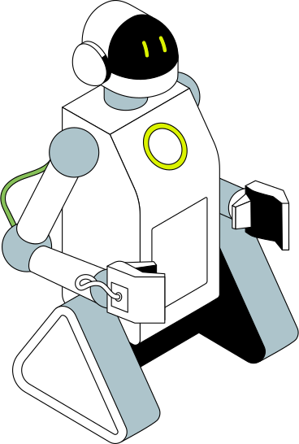

# AuthWA
{width='100' .center}

## Instalação

### Como instalar
> Rode o comando abaixo em seu terminal ou CMD!

    pip install authwa

### Como executar
> Importe o modulo e adicione a uma variavel, chamando a classe desejada!

    import authWA

    whats = authWA.WA()

    whats.enviar_msg()

## Whatsapp
Envio de mensagens simples e com Imagens no o Whatsapp, para deixar sua imaginação fluir e construir suas automações!

>### Objetivo
> A Intenção deste modulo do AuthWA, é que você consiga usar a critividade para criar suas automações.

## Parcial

## Tutorial
