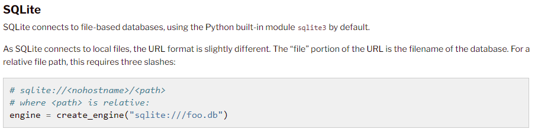
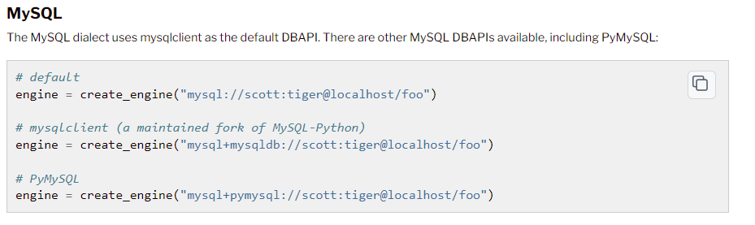

# AuthWA
{width='100' .center}

## Banco de Dados Permitidos!

## Instalação

### Como instalar
> Rode o comando abaixo em seu terminal ou CMD!

    pip install authwa

### Como executar
> Importe o modulo e adicione a uma variavel, chamando a classe desejada!

    import authWA

    whats = authWA.WA()

    whats.enviar_msg()
## Preparando o ambiente de envio
Para que seu codigo funcione é importante que deixe o whatsapp aberto, pois o codigo irá usar um atalho para acessa-lo *Alt + Tab*. 

*É importante também que __não movimente ou clique com o mouse e nem pressione nenhuma tecla__ durante o processo, o indicado é ter uma maquina como servidor para que posso ter mais eficiencia, mas não é obrigatório.* 

## Whatsapp
Envio de mensagens simples e com Imagens no o Whatsapp, para deixar sua imaginação fluir e construir suas automações!

>### Objetivo
> A Intenção deste modulo do AuthWA, é que você consiga usar a critividade para criar suas automações.

### Envio simples de mensagem
Para envio de mensagens simples, usando o modulo __WA__, é bem fácil, porém lembre-se bem deste módulo, pois ele será muito importante nos módulos a frente!

### Importando o WA()
    from authWA import WA

    whats = WA()

### A partir dai podemos utilizar seus modulos

> Dentro da WA temos os seguintes modulos

> - enviar_msg( )
> - sql_connection( )
> - cria_imagem_SQL( )

### enviar_msg()
Está função faz um envio __simples ou com uma imagem__ embutida, para isto precisa ter preparado o ambiente.

> **Parametros**

> Nome = Nome do Contato a ser enviado a mensagem

> Mensagem = Mensagem a ser enviada ou a Legenda que vai na imagem

> Img = Aqui você devera colocar o caminho da Imagem a ser enviada

    from authWA import WA

    whats = WA()

    # Envio sem imagem
    whats.enviar_msg(
        nome = "Nome do contato",
        mensagem = "Isto foi enviado pelo AuthWA"
    )

    # Envio com imagem
    whats.enviar_msg(
        nome = "Nome do contato",
        mensagem = "Isto foi enviado pelo AuthWA"
        img = "imagens/image.png"
    )

### sql_connection()
Para realizar uma conexão com o banco de dados, precisamos de alguns parametros, lembre-se sempre que for realizar uma conexão com o banco de dados, faze-la no **incio** do projeto!
> **Parametros**
>> **Obrigatórios**

> uid = Usuário DB

> pwd = Senha de Acesso do DB

> sevrer = Server do

>> **Opcional caso for utilizar o SQL Server**

> database = Banco de Dados a ser utilizado

> driver = Qual driver usar você encontra no site do SQL Alchemy:

> <a href = 'https://docs.sqlalchemy.org/en/20/core/engines.html'> Drivers do SQLAlchemy</a>

SQLite

SQL Server

MySQL

### Exemplo de código

    from authWA import WA

    whats = WA()

    # Obrigatorio
    conn = whats.sql_connection(
        uid = "usuario.aqui",
        pwd = "suasenhavemaqui",
        server = "10.0.1.0",
    )

    # Opcionais
    conn = whats.sql_connection(
        uid = "usuario.aqui",
        pwd = "suasenhavemaqui",
        server = "10.0.1.0",
        database = "DATABASE",
        driver = "SQL Server"
    )   

    print(conn)

    # Output
    // "Conexão realizada com sucesso!" ou "Conexão Invalida"

Pronto conexão realizada 

## Parcial

## Tutorial

<!-- ## Contate nos
  <a href = 'https://whatsa.me/bt-min.js?link=https://whatsa.me/5543996617904/?t=Ol%C3%A1%20vi%20seu%20projeto%20do%20AuthWA,%20e%20queria%20saber%20mais'> - Whatsapp</a> -->
